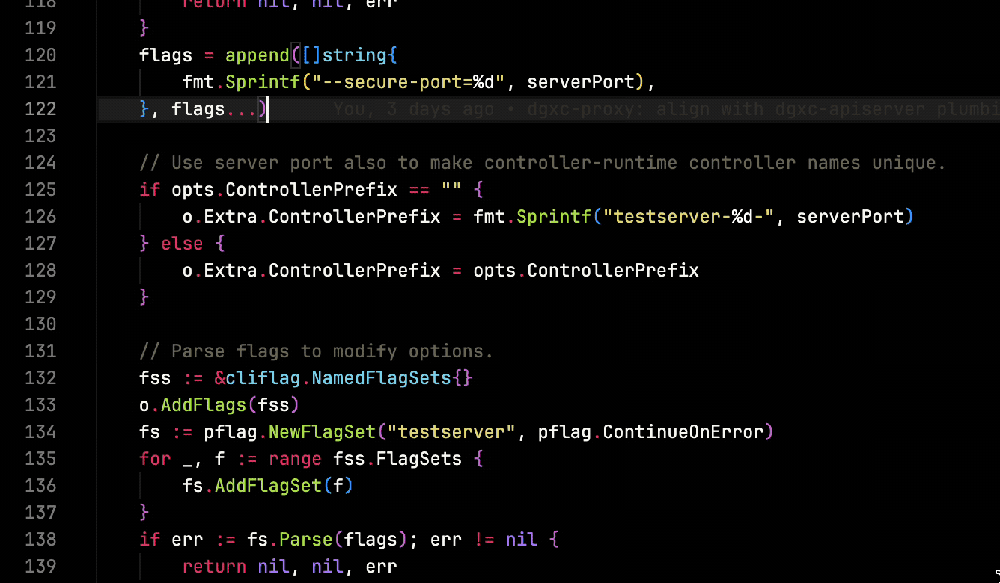
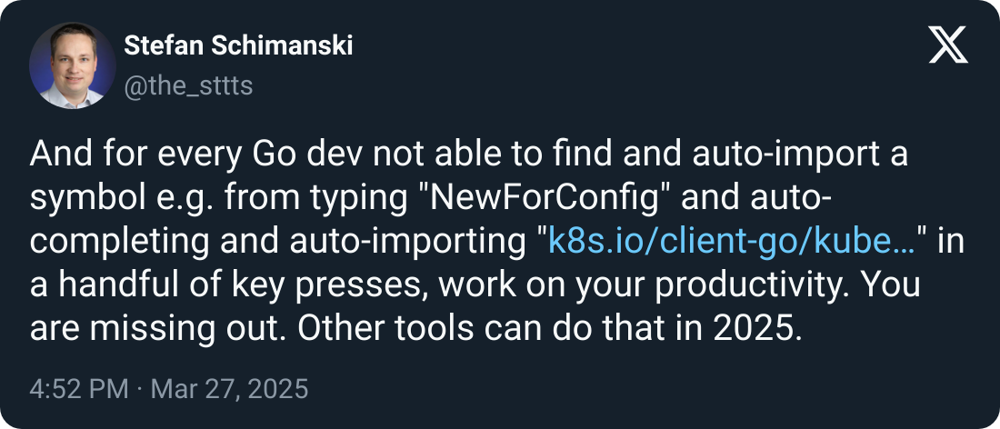

# Go Symbol Completion for VS Code

[](https://github.com/sttts/vscode-go-symbol-completion/actions/workflows/tests.yml)
[](https://github.com/sttts/vscode-go-symbol-completion/releases/latest)

> ⚠️ **EXPERIMENTAL**: This extension is an experiment in using [Cursor](https://cursor.sh) exclusively for development. **100% of the code was written without human modification** - all coding, debugging, and optimization was done through Cursor's AI interfaces, without direct human editing of the codebase.

A VS Code extension that provides symbol completion for Go code with or without package prefixes (similar to other popular IDEs), drastically improving the Go development experience in VS Code.

<p align="center">
  
</p>

## Motivation

This extension was born out of a common frustration among Go developers transitioning from other popular IDEs to VS Code:

<p align="center">
  
</p>

The built-in Go extension for VS Code requires you to type the full package name before offering completions. With this extension, you can type just the symbol name (like in other popular IDEs) and get full completions with automatic imports.

## Features

- **Smart IDE-style completions**: Type any symbol name without package prefix to get completions
- **Package prefixed completions**: Also supports traditional `package.Symbol` style completions
- **Automatic imports**: Automatically adds imports when you select a completion
- **Background indexing**: Indexes workspace and dependency packages for fast completions
- **Workspace-specific caching**: Maintains a local cache for optimal performance
- **Package reindexing**: Right-click on an import to reindex a package when it's updated

## Installation

### Option 1: VS Code Marketplace
1. Open VS Code
2. Go to Extensions (Ctrl+Shift+X)
3. Search for "Go Symbol Completion"
4. Click Install

### Option 2: Manual Installation
1. Download the `.vsix` file from the [GitHub releases page](https://github.com/sttts/vscode-go-symbol-completion/releases)
2. In VS Code, go to Extensions (Ctrl+Shift+X)
3. Click "..." in the top-right and select "Install from VSIX..."
4. Choose the downloaded file

## How to Use

Just start typing the name of any Go symbol - the extension will suggest completions from all indexed packages:

```go
// Instead of typing:
kubernetes.NewForConfig(...)

// You can just type:
NewForC█   // Shows "NewForConfig" suggestion with automatic import
```

Right-click on any import statement to reindex a package if you've updated it.

## Commands

- **Go: Reindex Package** - Reindex a specific package and its subpackages
- **Go: Show Symbol Cache** - View debug information about the symbol cache
- **Go: Show Package Debug Info** - Get detailed info about a specific package

## Configuration

| Setting | Description | Default |
|---------|-------------|---------|
| `goSymbolCompletion.enabled` | Enable/disable the extension | `true` |
| `goSymbolCompletion.debugLevel` | Log verbosity (0-3) | `1` |
| `goSymbolCompletion.limitToDirectDeps` | Only index direct dependencies | `true` |
| `goSymbolCompletion.provideCompletionsForSpecifiedPackages` | When a package is specified (e.g., 'fmt.') but not imported, provide completions for it | `true` |

## Requirements

- Go 1.12+ must be installed and in your PATH
- VS Code 1.60.0 or newer

## Known Issues

- Initial indexing may take time for large codebases
- Some edge cases in workspace-specific packages might need manual reindexing

## Contributing

Contributions are welcome! Feel free to submit issues and pull requests.

## License

This project is licensed under the Apache License, Version 2.0 - see the LICENSE file for details. 